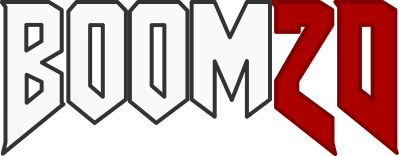

## About
2D Multiplayer deathmatch game inspired by Doom an Surviv.io

# Installing and setup
This project requires [Bun](https://bun.sh/) and [pnpm](https://pnpm.io/installation)

After installing the dependencies with `pnpm install` do the following to start it:

To start the server cd into the server directory and run `pnpm start` or `pnpm dev` for development server.

To start the client cd into the client directory and run `pnpm build` and `pnpm preview` for the production build or `pnpm dev` for the vite dev server
